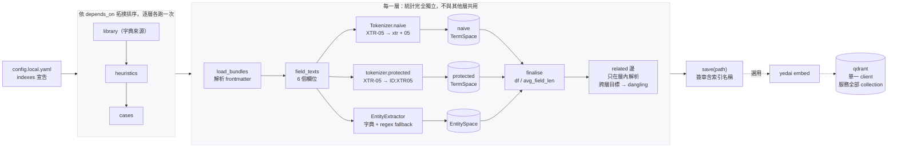
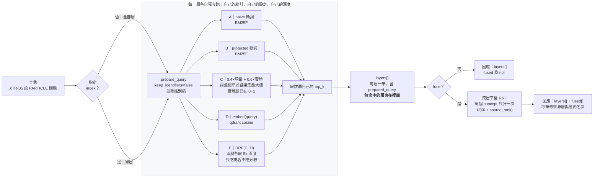

# yedai — 查案知識的分層檢索

給查案 agent 用的檢索系統：每一類知識是一個**獨立索引**，查詢時分層回傳。
底下同時是一組消融量測——每個機制值不值得，由數字決定而不是由主張決定。

它要回答的第一個問題是：

> 你的語料裡，文字主體是機台 id、製程 id、flow 等專有字詞。
> 一般斷詞會把 `TEL-05` 切成 `tel` + `05`，讓它與 `TEL-06` 幾乎無法區分。
> **識別碼到底需不需要特別處理？需要的話，停在斷詞層就夠，還是必須維護實體字典？**

---

## 語料是分層的

查案知識分成幾類，**每一類是一個獨立索引**，各自持有自己的詞彙與實體統計——
`df`、`avg_field_len`、實體 idf 都不跨層共用。

| 層 | 性質 | 檢索特性 |
|---|---|---|
| 查案心法 | 人寫、量大、無固定格式 | 真正的文字檢索；識別碼在這層是雜訊 |
| 已結案 | 固定格式、持續累積 | 識別碼是主訊號 |
| 缺陷登錄 | 每個 defect 一條 | 同時是實體字典來源，其他層依賴它 |
| defect → 判斷方法 | 每個 defect 一條，部分填充 | **查表，不進索引** |

**分層不是整理上的偏好。** 混在一份統計裡，持續累積的那一層每長大一次，其他層的
排名就漂移一次——沒有任何變更、沒有任何測試會紅，檢索品質卻退化了。實測：同一份
文件、同樣的查詢，另一層灌入 60 篇之後 BM25 分數從 0.50 掉到 0.027。

查詢時加過濾條件解不了：過濾只影響誰參與排序，碰不到 idf。這條性質有回歸測試
釘著（`tests/test_layers.py::test_growing_one_index_does_not_move_another`）。

---

## 五組消融

| 模式 | 內容 | 隔離出的變因 |
|---|---|---|
| **A** | 天真 BM25F，識別碼被一般斷詞切碎 | 水位線：什麼都不做 |
| **B** | BM25F + 識別碼保護斷詞（`TEL-05` 為單一詞元） | **斷詞層**的貢獻 |
| **C** | B + 實體字典正規化與精確匹配加權 | **字典**的額外貢獻 |
| **D** | 純稠密向量檢索 | 關鍵字腿失效的那一半查詢 |
| **E** | RRF(C, D) | **融合**的額外貢獻 |

只做兩組（A vs C）只能回答「合起來有沒有效」。分開才能回答「哪一個干預有效」——
如果 A→B 就補完大部分差距，字典那筆長期人力成本就不必付。

D 與 E 的理由是 A/B/C 答不出「關鍵字檢索本身夠不夠」。兩腿的失效模式相反：
關鍵字腿在「蝕刻後圖案倒塌要看哪些參數」這種查詢上會直接落空；
稠密腿則**分不出兄弟機台**（實測：以模式 D 查 `XTR-05`，第 2 名回 `XTR-06`）。
所以要的是融合而不是取代。見 [docs/dense.md](docs/dense.md)。

D/E 需要向量庫。沒有向量時它們是**不可用**，不是退化成 C——
靜默退化會讓報告顯示「稠密腿沒有帶來差異」，而真相是它根本沒有執行。

---

## 建立檢索

一次建構處理**一個具名索引**：讀入它宣告的語料，產出只屬於它的統計。
未指定 `-i` 時依 `depends_on` 的拓撲順序建全部。



**簽章納入索引名稱**，所以把索引檔放到另一層宣告的路徑下會被擋——兩份統計互換之後
檢索仍會回傳結果，只是分數全錯。

**上游重建會讓下游過期。** 缺陷登錄是實體字典來源，它一變，依賴它的層簽章就不符；
錯誤訊息會指名該重建哪些，而不是只說「請重建索引」。

```bash
uv run yedai index -c config.local.yaml            # 全部，依依賴順序
uv run yedai index -i cases -c config.local.yaml   # 只重建這一層
```

細節（設定鍵、統計數字怎麼看、何時必須重建）見 [docs/indexing.md](docs/indexing.md)。

---

## 查詢演算法

**預設分層回傳，不跨層排序。** 每層各自套用自己的 query 前處理、自己的模式、
自己的深度，結果各自呈現。



### 為什麼預設不給一份混好的排序

> RRF 融合的前提是**兩份排名在回答同一個問題**。

跨模式（C 與 D）滿足：同一份語料、同一個問題、失效模式互補。跨索引不滿足——
「這篇心法比那筆已結案更相關」不是一個有意義的命題，它們回答的不是同一件事。
要讓它們比大小就得發明一個共同尺度，而那個尺度不存在。

分層另有一個具體好處：**缺席變成訊號**。心法層為空，意思是「這類問題沒有既定查法，
你得自己推」——那是有用的資訊；壓成一份扁平清單之後，它與「排在 k 之外」不可區分。

`fuse=true` 保留了融合供對照——這個決定應該被量測，不是被宣稱。

### 沒有向量時 D/E 是「不可用」而不是退化成 C

靜默退化會讓報告顯示「稠密腿沒有帶來差異」，而真相是它根本沒有執行。
各層目前可用哪些模式，看 `/v1/stats` 的 `available_modes`。

計分公式與資料存放位置見 [docs/data-flow.md](docs/data-flow.md)。

---

## 文件

| | |
|---|---|
| [docs/api.md](docs/api.md) | API 參考：逐端點的參數、運作步驟、回應結構與錯誤碼 |
| [docs/data-flow.md](docs/data-flow.md) | 資料流圖（DFD）+ 計分公式 + 資料存放位置 |
| [docs/indexing.md](docs/indexing.md) | 如何建立索引、統計數字怎麼看、何時必須重建 |
| [docs/agent-tools.md](docs/agent-tools.md) | 七個 agent 工具、建議流程、MCP 接法、常見誤用 |
| [docs/dense.md](docs/dense.md) | 稠密腿與 RRF、換供應商的設定、語料外流閘門 |
| [docs/evaluation.md](docs/evaluation.md) | LLM 評估集：recall@k / MRR、標籤的兩個偏誤、怎麼讀 |
| [openspec/specs/](openspec/specs/) | 規格（需求與情境） |

## 安裝

```bash
uv sync
```

## 指向你的真實語料

```bash
# 1. 準備設定
cp config.example.yaml config.local.yaml     # config.local.yaml 已被 gitignore
cp dictionary.example.yaml dictionary.local.yaml   # 填入你的機台/製程/缺陷字典

# 字典也可以直接吃 MES 匯出的 CSV（不必手工轉成 YAML，兩者可並存）：
#   tool_id      單欄；含 `#` 的列自動歸為腔體（aepol1 / aepol1#pm1 同表）
#   defect_code  三欄 Module, defect code, defect name；name 就是別名欄
# 在 config.local.yaml 的 entity_sources 宣告。真實清單請命名為 *.local.csv——
# 那個樣式已被 gitignore，而本 repo 是公開的。

# 2. 建索引（bundle 根目錄 = 內含多個 bundle 子目錄的那一層）
#    索引格式版本變更時舊快取會被拒絕載入並提示重建，直接重跑這行即可
uv run yedai index -c config.local.yaml   # 語料路徑寫在設定的 indexes 裡

# 3. 驗證識別碼樣式涵蓋得了你的真實形狀（先做這步，否則後面的數字不能當真）
cp identifier-samples.example.yaml identifier-samples.local.yaml   # 填入真實形狀
uv run yedai check-formats -c config.local.yaml

# 4.（選用）建向量庫，啟用模式 D / E
#    ⚠️ 這會把 concept 全文送到設定的 base_url。非合成語料預設會被拒絕執行，
#       確認端點可信後才在 config 宣告 trusted_endpoint。見 docs/dense.md
cp .env.example .env                          # 填入金鑰；.env 已被 gitignore
uv run yedai embed -c config.local.yaml   # 每層寫進自己的 collection

# 5. 查詢（省略 -i 則分層檢索全部；空的層也會印出來）
uv run yedai search "XTR-05 的 particle 問題" -c config.local.yaml
uv run yedai search "XTR-05 的 particle 問題" -c config.local.yaml -i cases -m C
uv run yedai search "XTR-05 的 particle 問題" -c config.local.yaml --fuse   # 另附跨層融合

# 6. 各模式並排 + 重疊度（固定在單一層內——跨層比模式是在比兩件不同的事）
uv run yedai compare "XTR-05 的 particle 問題" -i cases -c config.local.yaml

# 7. 產一份查詢清單（真實查詢拿不到時）
#    識別碼、別名、描述詞全部從你的索引與字典取樣，只有句型是造的
uv run yedai gen-queries -i cases -n 40 -c config.local.yaml   # → queries.local.txt（已 gitignore）

# 8. 批次跑一整份查詢清單
uv run yedai compare -f queries.local.txt -i cases -c config.local.yaml

# 9. 產出可分享的去識別化報告
uv run yedai report -o report.json -c config.local.yaml
```

### 有內部 LLM 的話，還能再往上一層

上面整套只能回答「五個模式的結果**不一樣**」。要回答「哪一個**比較對**」需要標準答案。
內部 LLM 可以讀 concept 產出「這篇文件是哪個問題的答案」，那就是標籤：

```bash
uv run yedai gen-evalset -i cases -n 30 -c config.local.yaml   # → evalset.local.jsonl
uv run yedai evaluate  -i cases -f evalset.local.jsonl -o eval.json -c config.local.yaml
uv run yedai report -e eval.json -o report.json -c config.local.yaml
```

**先看 `symptom` 那一欄。** 識別碼式查詢上 A/B/C 佔優是預期內的，沒有資訊量；
不含識別碼的症狀式查詢才能回答「稠密腿值不值得」。

標籤有兩個必須一直帶著的偏誤（只涵蓋單篇相關文件、LLM 會照抄罕見詞），
所以絕對值不可外推、只能拿模式之間的差距來比。判讀方式見
[docs/evaluation.md](docs/evaluation.md)。

### 關於產生的查詢清單

真實查詢是這個實驗唯一的人力瓶頸。拿不到時 `gen-queries` 是替代方案，但要清楚它的界線：

**它能回答**：這些機制在你的語料上**會不會改變結果**。識別碼與其頻率分佈都是真的，
所以「模式 B 相對 A 改變了多少排名」是一個真的量測。

**它不能回答**：工程師是不是真的這樣查。句型是造的，各組成的比例也是訂的。

所以比例是參數，而且會寫進產出檔的檔頭。**換一組比例重跑**，就能看出結論對這個假設有多敏感——
一個對比例極度敏感的結論本來就不該被採信。有真實查詢時，直接餵真的那份。

## HTTP API

```bash
uv run yedai serve -c config.local.yaml
# Swagger： http://127.0.0.1:8000/docs
# ReDoc：   http://127.0.0.1:8000/redoc
```

每個端點的**參數、回應欄位與錯誤碼都在 OpenAPI schema 裡**，兩個文件頁都讀得到，
不必翻原始碼。

功能端點都在 **`/v1`** 之下，依用途分成五類；`/healthz` 與 `/version` 不帶版本前綴，
因為它們描述的是服務本身而非 API 契約——監控與部署不該因 API 改版而失效。

| 分類 | 端點 | 用途 |
|---|---|---|
| **retrieval**<br>找到 concept | `GET /v1/search?q=&index=&mode=&k=&fuse=` | **分層回傳**，只回菜單不回內容。省略 `index` 就查全部；`fuse=true` 另附跨層融合 |
| | `GET /v1/taxonomy/{defect}` | defect → 判斷方法。**查表不是檢索**，查無條目回 404、不給近似 |
| | `GET /v1/grep` | **限定範圍**的字面／正則搜尋；未給範圍會被拒絕 |
| **content**<br>取得內容 | `GET /v1/concept/{concept_id}` | 單一 concept 全文（`raw` + `frontmatter` + `sections` + `figures`） |
| | `POST /v1/concepts` | 批次取全文（最多 50 筆，部分成功語意） |
| | `GET /v1/concept/{concept_id}/asset?path=` | 下載該 concept 引用的資產，預設 inline |
| **graph**<br>沿關聯導航 | `GET /v1/concept/{concept_id}/neighbors` | 展開 1~2 跳；`direction=in` 回傳「誰指向我」 |
| **telemetry**<br>量測與回饋 | `GET /v1/compare?q=&index=` | 單一層內的 A–E 並排與重疊度（消融實驗） |
| | `POST /v1/feedback` | 記錄點選；`rank` 是**層內名次** |
| | `GET /v1/report` | 去識別化統計報告，依層拆解 |
| **ops**<br>服務與語料狀態 | `GET /v1/stats` | 各層語料統計、`available_modes`、taxonomy 覆蓋率、`id_overlap` |
| | `GET /healthz` | 健康檢查（不版本化） |
| | `GET /version` | 套件／API／各層索引格式（不版本化） |

`concept_id` 會自動解析到它所屬的層——從分層檢索拿到 id 之後，不必記得它從哪來。

前三類正好對應建議流程（stats → search → get → neighbors），所以分組本身就是流程說明。
`telemetry` 刻意獨立——那幾個端點服務的是 A–E 消融實驗，不是日常檢索，agent 不需要呼叫。

**逐端點的參數、運作步驟、回應結構與錯誤碼見 [docs/api.md](docs/api.md)。**
`/docs` 上每個回應模型都帶範例，`/v1/search` 與 `/v1/taxonomy` 還提供多個具名範例
（分層含空層 / 跨層融合、已整理方法 / 已登錄未整理）。

`GET /version` 會同時回報「本程式支援的索引格式」與「各層索引的格式」，
兩者無對應關係；「支援 v8、載入的是 v7」正是最需要一眼看出的除錯情境。

## 給 Agent 用（MCP）

```bash
uv run yedai mcp -c config.local.yaml
```

claude-agent-sdk / Claude Code 的設定：

```json
{
  "mcpServers": {
    "yedai": {
      "command": "uv",
      "args": ["run", "yedai", "mcp", "-c", "config.local.yaml"],
      "cwd": "/path/to/YEDAI"
    }
  }
}
```

七個工具：`search`、`get_concept`、`get_concepts`、`neighbors`、`grep`、`taxonomy`、`stats`。
細節與常見誤用見 [docs/agent-tools.md](docs/agent-tools.md)。

### 建議流程

```
stats（先知道有哪些層、各層叫什麼）
  └─ search（分層檢索，跨層挑 3~7 筆——不要只讀第一層）
       └─ get_concepts（批次取全文）
            ├─ neighbors（沿 related 展開，尤其 direction=in）
            └─ grep（在 search 給的 bundle_id 範圍內做字面搜尋）

taxonomy（以 defect 為鍵取判斷方法；獨立於上面這條線）
```

### 兩個刻意的限制

**`search` 不回內容，只回菜單。** 讓 agent 自己決定讀哪幾份全文，才保得住
「agent 當 reranker、讀完整文件」這個讓小規模 agentic file search 效果好的性質。
直接把 chunk 塞給 agent 就退化成一般 RAG 了。

**`grep` 必須先有範圍。** 允許無範圍搜尋等於留一條繞過檢索層的退路——agent 會用它，
然後我們回到「掃三十 GB、拿回三百條命中、無從分流」的原點。範圍取自 `search` 結果的 `bundle_id`。

### 圖怎麼拿

`/concept/{id}` 回傳的 `assets` 陣列可以直接餵給資產端點：

```bash
curl "$B/v1/concept/$CID" | jq -r '.assets[]' \
  | while read p; do curl -sO "$B/v1/concept/$CID/asset?path=$(jq -rn --arg x "$p" '$x|@uri')"; done
```

路徑以**該 concept 檔案所在目錄**為基準解析，和 markdown 相對連結、`## Citations`
的寫法完全一致，不用轉換。對 YED 語料這很重要——wafer map 與缺陷影像是證據本身，
文字圖說只是包裝。

安全上有三道約束：不接受絕對路徑與 `..`、必須在該 bundle 根目錄之下、
且必須在 `asset_dirs`（預設 `_assets`）之下。違反者一律 403。

### 全文的兩個性質

`raw` 是完整檔案內容，可直接餵進 LLM context；`sections` 是切好的
`{heading, text}`，適合「只讀根因段落」這類針對性取用。

全文是**請求時從磁碟讀**，不存在索引裡——所以改一個 `.md` 內容立即反映。
但**新增/刪除 concept 或改 `related` 仍要重建索引**，否則檢索排名與關聯圖還是舊的。

---

## 資料安全

這是本工具的設計前提，不是附註：

- **真實語料永不進版控** — `data/`、`bundles/`、`corpus/` 已被 gitignore
- **完整查詢日誌不可外流** — 含查詢原文與 concept id，寫在 `logs/`（gitignore）
- **只有 `yedai report` 的輸出設計為可分享** — 零語料內容，只有數值、分佈與設定參數

最後一點由測試強制守住，不靠慣例：`tests/test_telemetry.py::test_report_leaks_no_corpus_content`
會斷言報告序列化後不含任何查詢原文、concept 標題、描述或實體名稱。

如果報告洩漏了內容，你就不能把它帶出公司，這次資料收集對外部討論等於沒發生。

---

## 怎麼讀報告

**有 `evaluation` 那一段時就以它為準**——recall@k / MRR 才回答「哪一個比較對」，
重疊度只回答「有沒有不一樣」。判讀方式見 [docs/evaluation.md](docs/evaluation.md)。

沒有評估集時，最關鍵的單一指標是 **`mode_overlap`**：

```json
"mode_overlap": {
  "A-B": { "jaccard": { "median": 0.11 } },
  "B-C": { "jaccard": { "median": 0.67 } }
}
```

- `A-B` 的 jaccard **低** → 斷詞層有實際作用，識別碼必須保護
- `A-B` 的 jaccard **接近 1** → 天真斷詞已經夠好，後面所有機制都是過度設計
- `B-C` 的 jaccard **低** → 字典帶來額外資訊，值得投資維護
- `B-C` 的 jaccard **接近 1** → 停在斷詞層就好，別維護字典
- `C-D` 的 jaccard **接近 1** → 稠密腿只是換一種方式講同一件事，不必留
- `C-E` 的 jaccard **接近 1** → 融合沒有改變結果，不值得那筆 embedding 費用

其次看 `entities.by_type`——**不要只看全域的 `dictionary_coverage`**。

字典對不同類型的作用是相反的：對缺陷名（`微粒`、`刮傷`）它是**唯一來源**，
因為一般詞沒有結構可讓正則辨識，沒有字典那條腿就歸零；對機台識別碼它只是
**擋掉 regex 誤圈的白名單**，沒有字典只是精確度差一點。

全域比例把這兩者平均成一個中間值，於是「fallback 佔 60%」推不出任何結論——
拆開之後才分得出那 60% 是集中在無所謂的類型，還是集中在字典本該覆蓋的類型。

**`dictionary_coverage` 是 `null` 的類型，不要當成 0，也不要當成 1。** 它的意思是
「這個類型的分母算不出來」。只有每一次出現都必然被某條識別碼樣式圈到的類型
（`chamber_id`、`wafer`、`op_no`——實際清單見 `coverage_measurable_types`）才有比例。

機台可以裸寫成 `AEPOL1`，而裸寫的形狀跟製程、流程、料號長得一樣，正則分不出來；
缺陷名根本沒有形狀。這些類型的分母只數得到字典自己認得的部分，比例會恆為 1.0——
一個「字典已完整覆蓋、不必維護」的假象。這種情況給 `null` 比給數字誠實。
`total` 與 `regex` 的**計數**仍然可讀：它是「至少有這麼多實體在字典之外」的下界。

`experiment_params` 記錄了該次使用的所有參數——沒有它，任何數字都不可重現。

---

## 已知的調參旋鈕

- **識別碼正則過寬**：預設樣式包含空白分隔形式（`TEL 05`），會誤圈 `slide 005`、`page 12`
  這類詞組。漏抓比誤抓危險（會讓模式 B/C 被低估、導出錯誤結論），所以預設偏向recall。
  誤圈量會顯示在報告的 `from_regex_fallback`，整份清單可用 `identifier_patterns` 覆寫。
- **樣式是否涵蓋你的真實形狀，必須自己驗**。`uv run yedai check-formats` 會拿你本機的
  樣本檔逐條檢查。**沒跑過這個之前，模式 B/C 的數字不能當真**——樣式對不上真實形狀時
  不會報錯，只會安靜地讓模式 B 被低估。作法見 [docs/indexing.md](docs/indexing.md)。
- **父子層級展開有代價**：`aepol1#pm1` 會同時產生腔體層與機台層詞元，讓「查機台」
  命中只寫到腔體的文件。代價是機台層詞元變高頻、鑑別力下降——這部分由 BM25 的 idf
  自動吸收，不需調參，但若日後發現機台層查詢過於發散，這裡是第一個該看的地方。
- **BM25F 欄位權重是猜的**（title 3.0 / description 2.0 / body 1.0），首批真實數據回來後應調整。
- **融合權重**預設 `lexical 0.4 / entity 0.6`，偏向實體腿。
- **中文用 unigram + bigram**，不依賴 jieba——領域專有詞不在通用詞典裡，jieba 會切錯且錯法不可預測。

---

## 合成語料

開發者無法取得真實語料（公司機密），因此附一份格式相符的合成產生器供程式驗證：

```bash
uv run yedai gen-synthetic .synthetic -n 30 -s 42
```

> ⚠️ **合成資料僅供驗證程式正確性。**
> 它的詞頻分佈、識別碼密度、模板多樣性都是編造的，
> **不得用於調整任何參數，也不得用於推論任何檢索效果數字。**
> 所有效果結論必須來自你在真實語料上跑出的報告。

## 測試

```bash
uv run pytest
```

---

## 這不做什麼

刻意不做，因為它是對照組：reranker、issue family、graph DB、寫入路徑。
這些要不要做，由這支工具產出的數據決定。

向量檢索**原本也在這張清單上**，後來被移進來當模式 D/E——因為 A/B/C 答不出
「關鍵字檢索本身夠不夠」，而那個問題不先答掉，後面所有架構決定都沒有依據。
它進來的形式仍然是**消融的一條腿**，不是預設路徑：沒有向量庫時 D/E 不可用而非退化，
而 `C-E` 的重疊度接近 1 就是「不必付這筆 embedding 費用」的直接證據。

分層索引同樣是後來移進來的。它不是整理上的偏好——混在一份統計裡，持續累積的那一層
每長大一次，其他層的排名就漂移一次，而沒有任何測試會紅。查詢時加過濾條件解不了：
過濾只影響誰參與排序，碰不到 idf。

**分層之後刻意還沒做的**，因為它們各自需要先有數據：

| 還沒做 | 為什麼現在不做 |
|---|---|
| 已結案層的結構化比對 | 同格式文件的相似度該逐欄位比，不是整篇 BM25。需要先定義可比對的維度 |
| 以歷史結案回放的 root-cause 評估 | 目前的評估集量的是文字檢索，那是心法層的負載，不是已結案層的 |
| 逐頁攝入與頁型分類 | 攝入管線在上游，本專案先把索引邊界切對 |
| 影像檢索（defect map / SEM） | 沒有結構化比對當水位線，無從判斷視覺腿值不值得那筆成本 |
| 增量索引 | 分層已把重建成本關進單層，先花這筆時間紅利 |
| 時間衰減排序 | 那是排序信號不是索引結構，現在做會混淆兩件事 |

**taxonomy 刻意不進索引。** 它是每個 defect 一條的判斷方法，存取方式是以鍵取回，
不是回傳 top-k。放進倒排索引，呼叫端拿到的會是「最像的幾列」而且會很自信——
拿另一個 defect 的判斷方法去解讀影像，比沒有方法更糟。
