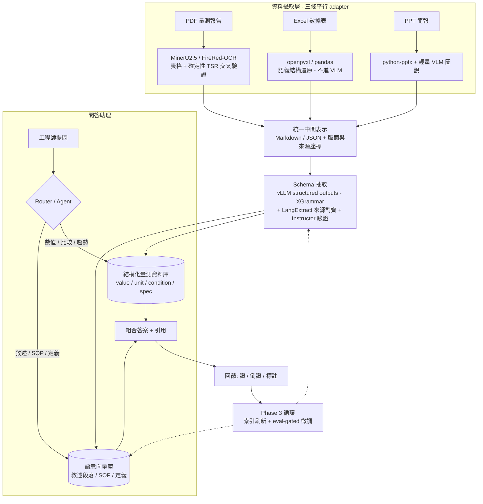

# YED 量測知識助理 — 專案規劃

> 一個給量測部門工程師使用、以原始文件為依據並附引用的問答助理，  
> 底層由「結構化量測資料庫 + 語意 RAG」混合檢索驅動，並以人為核心建立持續改進循環。

---

## 1. 目標與範圍

### 核心產出

一個工程師面向的問答助理，能用自然語言回答問題，且**每個答案都附帶可回溯到原始文件位置的引用**。

### 必須支援的四類查詢（已確認）

| 類型                     | 範例                                    | 主要後端                 |
| ------------------------ | --------------------------------------- | ------------------------ |
| 查特定數值               | 「lot A123 在 TEL-05 的 CD 量測值？」   | 結構化資料庫             |
| 比較與趨勢               | 「這三批的 overlay 趨勢如何？」         | 結構化資料庫（聚合查詢） |
| 異常／失效排查（敘述性） | 「這片 wafer overlay 超規的可能原因？」 | 語意 RAG                 |
| 規格／SOP／定義查詢      | 「這個量測項目的 USL/LSL 定義？」       | 語意 RAG                 |

四類同時涵蓋「精確數值」與「敘述理解」兩種需求，因此助理**不能是單純的語意 RAG**，必須採混合式架構（見 §3）。

### 明確不做（Out of Scope）

- 讓模型**自主更新自己權重**的全自動學習循環（風險高、不可稽核，不納入本計畫）。
- 機密分級與存取控制（依需求方說明，資料皆已驗證，本版不處理權限隔離）。
- 即時線上量測資料串流接入（本版以既有文件批次處理為主）。

---

## 2. 設計原則

1. **解析（Stage A）與抽取（Stage B）分離**：先把文件還原成高保真中間表示，再從中間表示抽出目標欄位，兩步用不同工具、各自優化。
2. **確定性優先，LLM 只補語義**：能用規則／版面／表格網格確定抽出的（數值、料號、日期）一律走確定性管線；LLM 留給需要理解語義的部分。
3. **密集數值表不交給通用 VLM**：量測表是 VLM 最容易幻覺數字的地方，改走專用表格結構辨識 + 確定性交叉驗證。
4. **每個值都要能回溯來源**：value 必附文件位置（source grounding），這是稽核、除錯與引用的基礎。
5. **評測先行**：沒有 golden set 與量化指標，後續所有改進都沒有方向盤。

---

## 3. 整體架構



三條 ingestion adapter 平行開發、皆輸出到**同一份統一中間表示**，因此「三種檔案一起做」在架構上成立；只是 PDF 表格那條工時最長，Excel／PPT 會較早完成。

---

## 4. 技術選型

> 以下模型依 2026 年中公開 benchmark（OmniDocBench v1.5 等）挑出候選，**最終以本專案 golden set 實測為準**；公開 benchmark 已趨飽和且不含半導體量測文件。

### Stage A — 文件解析

| 用途               | 首選                                              | 備援 / 交叉驗證                   | 備註                           |
| ------------------ | ------------------------------------------------- | --------------------------------- | ------------------------------ |
| PDF 版面 / 文字    | GLM-OCR (0.9B) 或 PaddleOCR-VL-1.5 (0.9B)         | —                                 | 輕量、自架吞吐量高             |
| PDF 表格（含中文） | MinerU2.5（結構 TEDS 最佳）或 FireRed-OCR (2B)    | 框線表加 TableFormer 系確定性 TSR | 量測表最關鍵，**不用通用 VLM** |
| Excel              | openpyxl / pandas                                 | —                                 | 結構化資料，做語義結構還原即可 |
| PPT                | python-pptx（文字／表／備忘稿）+ 輕量 VLM（圖表） | —                                 | 內容稀疏，資訊壓在視覺上       |

### Stage B — 結構化抽取

- **約束解碼引擎**：vLLM 內建 structured outputs（預設後端 XGrammar），保證輸出符合 schema。量測 schema 多為重複型，XGrammar 在 grammar 可重用時效能最佳。
- **抽取框架**：LangExtract（內建 source grounding，每筆抽取附字元位置；長文件切塊／平行／多輪）＋ Instructor（Pydantic 型別驗證）。
- **驗證層**：型別檢查 + 單位正規化 + 範圍合理性 guardrail + 一輪自我校驗（reflection），不過者 re-prompt 或標記送人工。

### 儲存與服務

- **結構化量測資料庫**：關聯式 DB（PostgreSQL 等），支援 text-to-SQL 查詢。
- **語意向量庫**：向量庫 + hybrid search（向量 + BM25，RRF 融合 + reranker）。
- **模型服務**：vLLM on H100（沿用既有部署）。
- **Router / Agent**：判斷查詢類型、路由到 SDB 或 VEC、組合答案並附引用。

---

## 5. 資料模型概要（量測抽取 schema）

核心原則：**值、單位、條件、規格分開存，並做來源對齊**。

```
MeasurementRecord:
  doc_id            # 來源文件
  source_span       # 字元位置 / 頁碼 / 表格座標（source grounding）
  lot_id / wafer_id / tool_id / part_no   # 識別碼（確定性抽取）
  metric            # 量測項目（e.g. CD, overlay, thickness）
  value: float      # 數值
  unit: str         # 單位（強型別，落庫前正規化到基準單位）
  condition         # 量測條件（溫度 / recipe / 量測點…）
  spec: {usl, lsl, target}   # 規格上下限與目標（與 value 分清楚）
  validated: bool   # 是否通過範圍 guardrail
```

> `3.5 nm` 與 `3.5 µm` 差千倍 → unit 為強型別並正規化；落在物理上不可能範圍的值 → 標記送人工，不默默入庫。

---

## 6. 分階段計畫

### Phase 0 — 地基與評測集

- **目標**：建立後續所有改進的「方向盤」。
- **產出**：20–50 份代表性文件的 golden set（含人工標準答案）；評測腳本。
- **驗收指標**：抽取正確率、數值內容正確率、來源對齊率、問答正確率（四項基線數字）。
- **風險**：標註成本被低估 → 先小規模、聚焦最高頻文件類型建第一版。

### Phase 1 — 抽取管線 + 結構化資料庫

- **目標**：三 adapter → 統一中間表示 → schema 抽取 → 驗證 → 落庫，可離線批次重跑。
- **產出**：可重跑的 ingestion pipeline；結構化量測資料庫；語意向量庫。
- **驗收指標**：在 golden set 上達到 Phase 0 設定的抽取／數值正確率門檻（建議數值內容正確率先訂 ≥ 95% 再逐步拉高）。
- **風險**：PDF 密集表格幻覺 → 以確定性 TSR 交叉驗證 + 範圍 guardrail 守住。

### Phase 2 — 混合式問答助理（第一個可用版本 / MVP）

- **目標**：上線可用的問答助理，四類查詢都能答、且附引用。
- **產出**：Router/Agent + 結構化檢索（text-to-SQL）+ 語意 RAG（hybrid search + rerank）+ 引用回填。
- **驗收指標**：四類查詢各自的問答正確率 + 引用正確率達門檻；「不確定」查詢會主動標記而非硬答。
- **風險**：text-to-SQL 在複雜聚合查詢出錯 → 限定查詢模板 + 結果再驗證。

### Phase 3 — 回饋循環（自我學習的務實版）

- **目標**：讓系統靠工程師回饋持續變好，人始終在迴路內。
- **機制**：
  - 收集：讚 / 倒讚 / 標註正確答案 / 補充缺漏。
  - 策展：把驗證過的回饋變成新知識條目或問答對（可半自動標籤化）。
  - 更新：(a) **即時**刷新知識索引與抽取規則（主力）；(b) **週期性**、且**必須通過 Phase 0 評測才放行**的微調（LoRA）。
  - 主動求助：碰到「不確定」的查詢標記丟給資深工程師 → 同時降風險並產生最高價值訓練訊號（可參考 ARIA 式的不確定性自評 + 人類專家補充）。
- **驗收指標**：每次更新後 golden set 指標不退步（eval-gated 為硬規則）；回饋轉化為改進的週期時間。
- **風險**：回饋資料偏誤或汙染 → 策展需人工把關，微調一律 eval-gated。

---

## 7. 評測框架（貫穿所有階段）

| 指標                 | 量什麼                          | 用在                   |
| -------------------- | ------------------------------- | ---------------------- |
| 結構 TEDS            | 表格網格還原正確性              | Stage A 表格選型       |
| 數值內容正確率       | 抽出的數字 / 單位是否與原文一致 | Stage B 驗收（最關鍵） |
| 來源對齊率           | 每筆抽取能否正確回指原文位置    | 稽核 / 引用            |
| 問答正確率（分四類） | 助理回答是否正確                | Phase 2/3 驗收         |
| 引用正確率           | 引用是否真的支持答案            | Phase 2/3 驗收         |

> 每次索引更新或模型更動都要重跑這組指標；不通過不上線。

---

## 8. 風險總表

| 風險                         | 影響          | 緩解                                        |
| ---------------------------- | ------------- | ------------------------------------------- |
| VLM 在密集數值表幻覺         | 數據錯誤入庫  | 專用 TSR + 確定性交叉驗證 + 範圍 guardrail  |
| 公開 benchmark ≠ 你的文件    | 選錯模型      | 一切以 golden set 實測為準                  |
| 「全部一起」造成 v1 範圍膨脹 | 交付延遲      | 三 adapter 平行、共用中間表示；允許錯開完工 |
| text-to-SQL 複雜查詢出錯     | 比較/趨勢答錯 | 查詢模板化 + 結果驗證 + 不確定就轉人工      |
| 回饋汙染微調                 | 模型退步      | 策展人工把關 + 微調 eval-gated              |

---

## 9. 待確認（會影響資源與時程估算）

1. **資料規模**：文件總量級（千 / 萬 / 十萬份？）→ 影響 ingestion 算力與儲存設計。
2. **人力與時程**：個人專案還是團隊？預期里程碑時間點？
3. **是否已有部分標註 / ground truth** 可直接拿來起 golden set？
4. **PDF 中掃描件（需 OCR）佔比**：掃描件比例高會明顯拉長 Stage A 工時。
5. **量測項目（metric）的封閉集合**：是否有現成的項目／單位字典可直接給 schema 用？

---

_本規劃為討論基礎版，可隨上述待確認項補完後迭代。_

---

## 附錄 A — 各組件最新參考模型與論文（2026 年中）

> 以下數字多為公開 benchmark 自報結果，且 benchmark 已趨飽和、不含半導體量測文件。  
> 每個「首選」都只是縮小候選的起點，最終以本專案 golden set 實測為準。優先列出**可自架／開源權重**選項。

### A.1 Stage A｜文件解析 VLM

依 **OmniDocBench v1.5** 排行（整體分數）：

| 模型             | 規模  | 整體 | 表格 TEDS       | 重點                                                  |
| ---------------- | ----- | ---- | --------------- | ----------------------------------------------------- |
| GLM-OCR          | 0.9B  | 94.6 | 85.2            | 目前整體 SOTA，極輕量                                 |
| PaddleOCR-VL-1.5 | 0.9B  | 94.5 | 84.6            | 多語、輕量；PaddleOCR-VL-L 表格內容 TEDS 最高(0.9046) |
| FireRed-OCR      | 2B    | 92.9 | **90.3**        | 專用模型中表格最強                                    |
| DeepSeek-OCR2    | 3B    | 91.1 | 87.8            | 通用強                                                |
| MinerU 2.5       | ~1.2B | 90.7 | 結構 **0.9539** | 中文+表格**結構**最佳；coarse-to-fine 架構            |
| dots.ocr         | 2.7B  | 88.4 | 86.8            | —                                                     |

- 共同基準：**OmniDocBench**（PDF 文件解析評測；含 OmniDocBench-Table-block 表格子集）。
- 多模態 RAG 趨勢：直接對表格／圖表做視覺推理而不先轉文字（Multi-Modal Agentic RAG）。

### A.2 表格結構辨識（密集數值表的守門員）

| 模型／方法         | 重點                                                        | 參考                      |
| ------------------ | ----------------------------------------------------------- | ------------------------- |
| **MinerU 2.5**     | OmniDocBench-Table-block 結構 TEDS 0.9539（最佳結構還原）   | MinerU 專案               |
| **PaddleOCR-VL-L** | 表格整體 TEDS 0.9046、最低編輯距離                          | PaddleOCR 專案            |
| **TableFormer**    | PubTabNet 結構 TEDS ~96.75；確定性 TSR，適合交叉驗證        | IBM；Docling 預設表格管線 |
| **MTL-TabNet**     | FinTabNet 結構 TEDS 98.79（最接近你密集數值表的金融表場景） | 多任務 TSR                |

> 量測表建議：MinerU2.5 / FireRed-OCR 為主，框線表加 TableFormer 系確定性 TSR 做交叉驗證。

### A.3 Stage B｜結構化抽取 / 約束解碼

| 工具                | 角色                 | 重點                                                                                           |
| ------------------- | -------------------- | ---------------------------------------------------------------------------------------------- |
| **XGrammar**        | 約束解碼引擎（首選） | vLLM/SGLang/TensorRT-LLM 預設後端；PDA 支援遞迴 schema；<40µs/token；schema 可重用時靠快取最快 |
| **llguidance**      | 約束解碼引擎（替代） | Microsoft，Rust Earley parser；動態 schema 下 TTFT 更快、零逾時                                |
| **Outlines**        | 約束解碼引擎         | FSM 為基礎，無法處理遞迴                                                                       |
| **LangExtract**     | 抽取框架             | 內建 source grounding（每筆附字元位置）；長文件切塊／平行／多輪                                |
| **Instructor**      | 抽取框架             | Pydantic 型別驗證                                                                              |
| **PARSE**（Amazon） | 方法                 | 反思式抽取 + 雙重 guardrail；第一次重試內抽取錯誤降低 92%                                      |

### A.4 嵌入模型與 Reranker（語意 RAG 那條腿）

基準：**MTEB / MMTEB**（注意 v2 與 v1 分數不可直接比較，且分數為自報）。

| 模型                               | 規模 / 授權             | 重點                                                                                                                        |
| ---------------------------------- | ----------------------- | --------------------------------------------------------------------------------------------------------------------------- |
| **BGE-M3**                         | 568M / 開源             | 100+ 語言；單一模型同時輸出 dense+sparse+ColBERT，等於一模型取代「dense+BM25+reranker」——中文開源基準、最務實的 hybrid 路線 |
| **Qwen3-Embedding**                | 0.6B/4B/8B / Apache-2.0 | 多語與長文理解強，可自架、可微調                                                                                            |
| **Llama-Embed-Nemotron-8B**        | 8B / 開源權重           | 2026/03 多語 MTEB 榜首，NVIDIA                                                                                              |
| **Qwen3-VL-Embedding / -Reranker** | 2B/8B                   | 多模態統一框架，SOTA 多模態檢索；reranker 8B 變體最佳（arXiv:2601.04720）                                                   |
| Gemini Embedding 2                 | 閉源 API                | 多模態(文/圖/影/音/PDF)、3072 維（自架不適用，僅供對照；arXiv:2503.07891）                                                  |

> 你的場景（中文、自架）建議：**BGE-M3（hybrid 一站式）** 或 **Qwen3-Embedding** 起步；reranker 用 Qwen3-VL-Reranker 或 BGE-reranker。

### A.5 Text-to-SQL（結構化數值 / 比較 / 趨勢查詢）

基準：**BIRD**（含 BIRD-Interact 互動模式、BIRD-CRITIC SQL 除錯）、**Spider**、**LiveSQLBench**（無汙染）。

| 系統 / 模型                             | 重點                                                               | 參考                                |
| --------------------------------------- | ------------------------------------------------------------------ | ----------------------------------- |
| **Agentar-Scale-SQL**                   | BIRD 測試集 81.67% EX，官方榜首；orchestrated test-time scaling    | arXiv:2509.24403                    |
| **ReViSQL**                             | 人類水準；235B-A22B 較 SOTA 開源 agent 高 5.6–9.8% EX              | arXiv:2603.20004                    |
| **Contextual-SQL (bird-sql)**           | **最佳全本地方案**，BIRD-dev ~73% EX；平行候選 + reward model 選擇 | github.com/ContextualAI/bird-sql    |
| **Gemma 3 (27B) / Qwen2.5-Coder (14B)** | 最強開源 zero-shot 基線（可自架）                                  | BAPPA, arXiv:2511.04153             |
| **MARS-SQL / MAC-SQL**                  | 多代理（RL / 協作）框架                                            | arXiv:2511.01008 / 2312.11242       |
| **BIRD-CRITIC (SWE-SQL)**               | SQL 除錯 / 修復 agentic 基線                                       | github.com/bird-bench/BIRD-CRITIC-1 |

> 安全提醒：把 DB 連線當成安全邊界——唯讀角色、查詢 allowlist，不要靠模型自己拒絕壞查詢。

### A.6 檢索架構 / Router（Agentic / Adaptive RAG）

| 主題                          | 重點                                                                           | 參考                                      |
| ----------------------------- | ------------------------------------------------------------------------------ | ----------------------------------------- |
| **Agentic RAG Survey**        | 依 agent 數量／控制結構／自主性的分類法；reflection+planning+tool use          | arXiv:2501.09136                          |
| **Adaptive RAG**（2026 主流） | 用查詢分類器依複雜度路由到不同檢索策略——正對應你「四類查詢」的 Router 設計     | —                                         |
| **Self-RAG**                  | reflection token 做 IsSupportive / IsUseful 把關；可用 structured outputs 近似 | arXiv:2310.11511                          |
| **GraphRAG**                  | 把文件轉實體+關係知識圖，支援多跳關係查詢（適合根因排查）                      | —                                         |
| **Awesome-RAG-Reasoning**     | RAG×推理論文總整理（RAG-Critic、AlignRAG、EviOmni 等）                         | github.com/DavidZWZ/Awesome-RAG-Reasoning |

### A.7 回饋循環 / 自我改進

| 方法         | 重點                                                                  | 定位                           |
| ------------ | --------------------------------------------------------------------- | ------------------------------ |
| **ARIA**     | 結構化自評不確定性、主動向人類專家求解；已部署 TikTok Pay（過億用戶） | **建議採用**：人在迴路、低風險 |
| **Self-RAG** | 以自我反思 token 評估檢索與答案品質                                   | 線上把關                       |
| **SEAL**     | 模型自產微調資料並用 RL 更新自身權重                                  | 研究階段，**本計畫不採用**     |

### A.8 領域 LLM（可選底座）

| 模型         | 重點                                                                             | 參考                                           |
| ------------ | -------------------------------------------------------------------------------- | ---------------------------------------------- |
| **SemiKong** | 首個半導體產業開源 LLM，Llama 3.1 70B；兩階段（領域預訓練+微調），純微調效果有限 | Aitomatic / Tokyo Electron / FPT / AI Alliance |

---

## 附錄 B — 各組件首選一覽（自架條件）

| 組件             | 首選                                                  | 備援 / 交叉驗證                  |
| ---------------- | ----------------------------------------------------- | -------------------------------- |
| PDF 版面/文字    | GLM-OCR 或 PaddleOCR-VL-1.5                           | —                                |
| PDF 表格         | MinerU2.5 / FireRed-OCR                               | TableFormer 確定性 TSR           |
| Excel / PPT      | openpyxl / python-pptx                                | 輕量 VLM 補圖說                  |
| 約束解碼         | vLLM structured outputs（XGrammar）                   | llguidance                       |
| 抽取框架         | LangExtract（來源對齊）                               | Instructor（型別驗證）           |
| 嵌入             | BGE-M3 或 Qwen3-Embedding                             | Llama-Embed-Nemotron-8B          |
| Reranker         | Qwen3-VL-Reranker                                     | BGE-reranker                     |
| Text-to-SQL      | Contextual-SQL（本地）/ Agentar-Scale-SQL（架構參考） | Gemma 3 27B / Qwen2.5-Coder 基線 |
| Router           | Adaptive RAG + Self-RAG 把關                          | Agentic RAG（多代理）            |
| 回饋循環         | ARIA 式人在迴路                                       | —                                |
| 領域底座（可選） | SemiKong-70B                                          | 通用開源指令模型                 |
