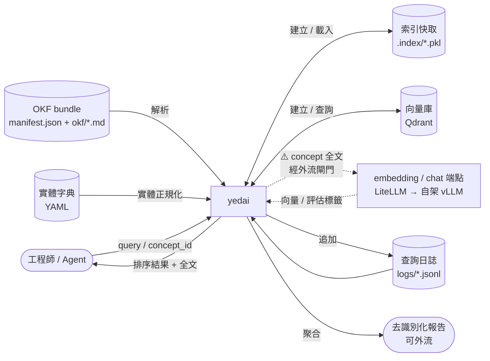
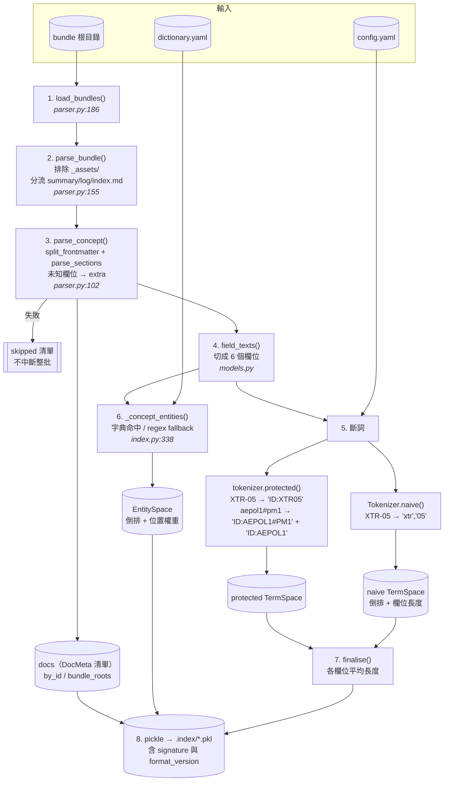
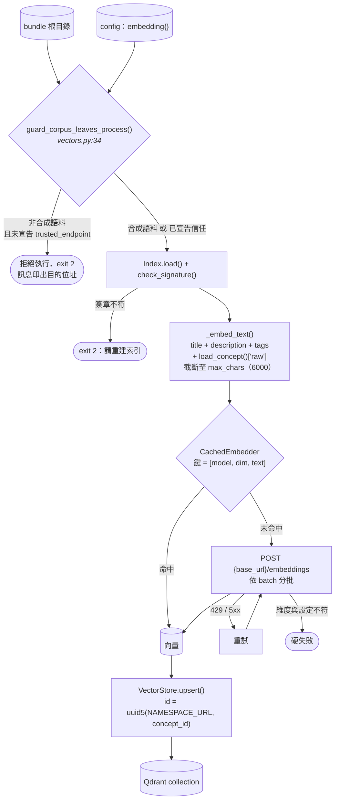
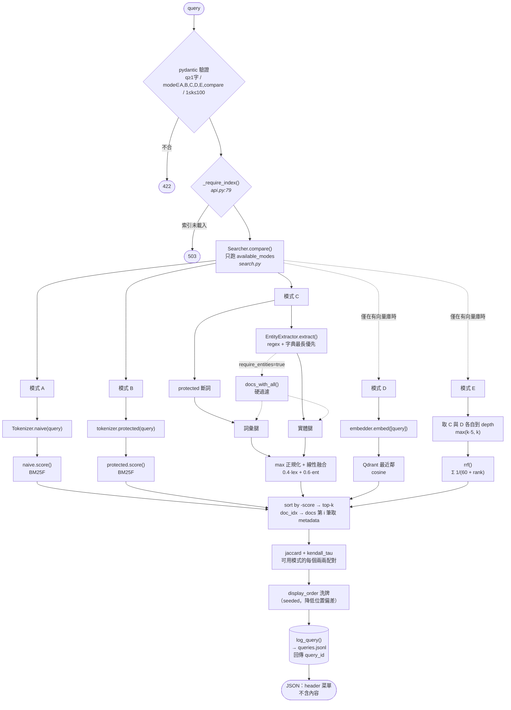
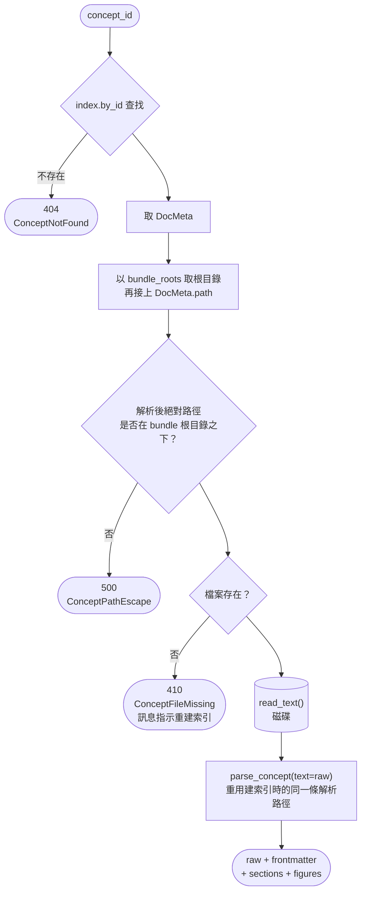
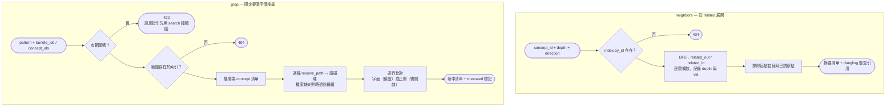
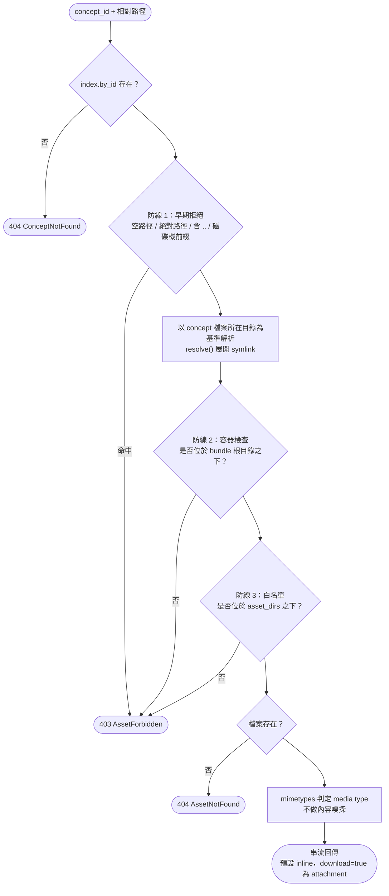
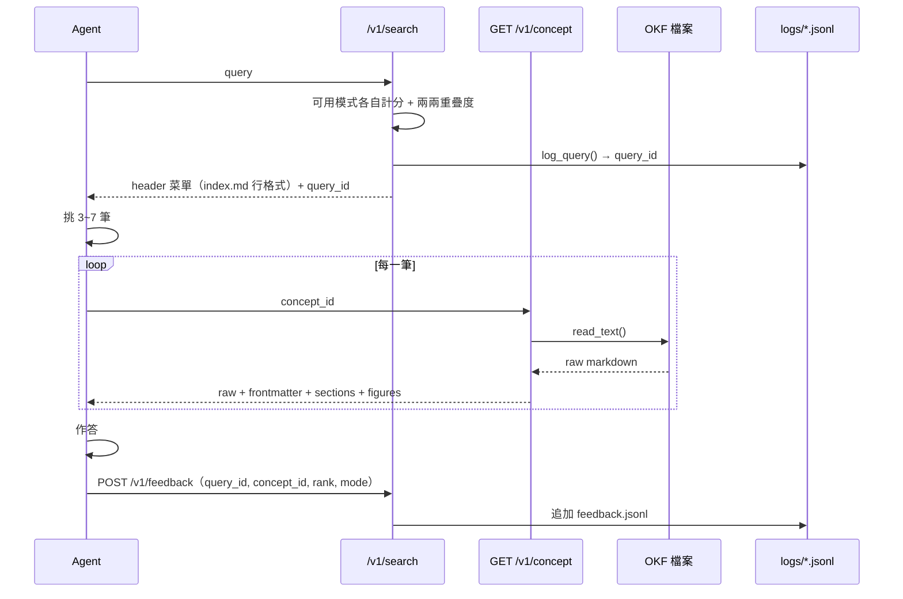
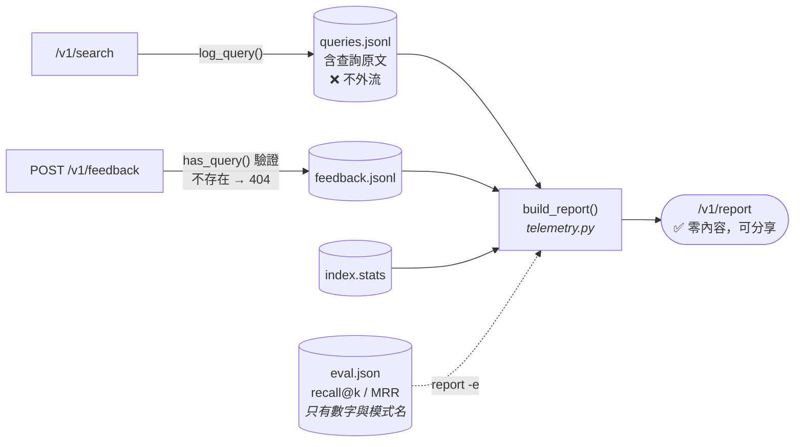

# Data Flow

資料從 OKF bundle 進入系統，到查詢結果與全文回到呼叫端的完整路徑。
單一端點的參數與回應結構見 [api.md](./api.md)——這份談的是資料如何流動。

系統有**兩個時間上分離的階段**：離線建索引（`yedai index`、選用的 `yedai embed`）與
線上查詢（HTTP / CLI）。兩者唯一的介面是磁碟上的索引檔、向量庫與原始 OKF 檔案。

---

## Level 0 — 情境圖



**信任邊界**：`OKF bundle`、`索引快取`、`向量庫`、`查詢日誌` 全部含機密內容，只存在本機。
只有 `去識別化報告` 設計為可外流——它不含任何查詢原文或語料內容。

**唯一一條會把語料送出程序的邊**是那條虛線（`yedai embed` 與 `yedai gen-evalset`）。
它由 `guard_corpus_leaves_process` 把關：非合成語料 + 未宣告信任 → **拒絕執行**，不是警告。
`embedding` 與 `llm` 的信任宣告**各自獨立**，即使兩者指向同一個位址——把信任從一個端點
自動延伸到另一個，正是這道閘門要防的事。見 [dense.md](./dense.md)。

---

## Level 1 — 階段一：離線建索引

指令：`yedai index <bundles-dir> -c config.yaml`



### 每個 concept 被切成 6 個欄位

`Concept.field_texts()` → `title` / `description` / `tags` / `headings` / `figures` / `body`
（`FIELDS`，`config.py:16`）。BM25F 對每個欄位獨立做長度正規化後加權合併。

### 同一份語料建了三套索引（再加一套選用的向量庫）

| 空間 | 內容 | 服務哪個模式 | 何時建立 |
|---|---|---|---|
| `naive` TermSpace | 天真斷詞的倒排索引 | **A** | `yedai index` |
| `protected` TermSpace | 識別碼保護斷詞的倒排索引 | **B**、**C** 的詞彙腿 | `yedai index` |
| `EntitySpace` | 實體倒排索引 + 位置權重 | **C** 的實體腿 | `yedai index` |
| Qdrant collection | concept 摘要文字的稠密向量 | **D**、**E** 的稠密腿 | `yedai embed`（選用） |

全部建在**完全相同的 concept 集合**上，所以模式之間的差異只來自索引方式，不來自語料。

**沒有向量庫時 D/E 是不可用，不是退化成 C。** 靜默退化會讓報告顯示「稠密腿沒有帶來
差異」，而真相是它根本沒有執行——那是這份量測最不該搞混的兩件事。

### 父子層級展開

機台與腔體寫在同一個識別碼裡，以 `#` 分界（`aepol1#pm1`）。斷詞時**同時**產生
子層與父層兩個詞元，所以查 `aepol1` 也會命中只寫到 `aepol1#pm1` 的文件：

```
aepol1#pm1  →  ID:AEPOL1#PM1     子層：與其他機台的 PM1 不混淆
               ID:AEPOL1         父層：讓機台層查詢命中腔體層文件
```

展開只依字串結構，**不查字典**——字典覆蓋率是本實驗要量測的未知數，
拿它當前提會讓兩個機制的效果無法分離。

`Tokenizer.protected()` 與 `find_identifiers()` 必須同步展開，否則詞彙腿認得父層、
實體腿不認得，模式 B 與模式 C 會對同一個查詢給出不一致的結果。

### 索引裡有什麼、沒有什麼

**有**：`DocMeta`（id / bundle / type / title / description / path / tags / timestamp）、
詞頻與欄位長度統計、實體權重、`by_id`、`bundle_roots`、關聯邊
（`related_out` / `related_in` / `dangling`）、`CorpusStats`。

**沒有**：**任何 concept 的 body 內容**。全文於請求時從磁碟讀（見下方階段三）。
這由測試強制守住：`tests/test_fulltext.py::test_index_does_not_contain_body`
會把索引 pickle 成位元組並斷言 body 標記不在其中。

---

## Level 1 — 階段一之二：建向量庫（選用）

指令：`yedai embed <bundles-dir> -c config.yaml`

這是**唯一會把語料送出程序**的離線路徑。索引必須先建好——向量庫按 `index.docs` 的
順序走，沒有索引就沒有要嵌入的清單。



### 三個刻意的決定

**維度不符是硬失敗，不是警告。** 自架的 Qwen3-Embedding 若經 MRL 截短就不是 4096；
維度錯了仍然算得出看似正常的餘弦相似度，錯誤不會有任何徵兆。同理
`ensure_collection()` 遇到維度不同的既有集合會**重建**而非沿用——沿用會留下一份
「部分舊模型、部分新模型」的向量庫，那種混合不報錯，只讓相似度在文件之間不可比。

**point id 由 concept_id 導出**（`uuid5`），所以重跑是覆蓋而非重複寫入。

**快取鍵含 model 與 dim。** 換模型後舊向量自動失效，否則會混出一份對應不到任何
可解釋產生過程的向量庫。

---

## Level 1 — 階段二：線上查詢

`GET /v1/search?q=…&mode=compare&k=10`（`api.py:137`）



> ⚠️ **HTTP 服務目前不載入向量庫**（`runtime.py` 建 `Searcher` 時不帶 `vectors`），
> 所以走 API 時 `available_modes` 只有 A/B/C，`mode=D`/`E` 會失敗。
> 稠密腿只在 CLI 可用——見下方[缺口表](#目前流程的缺口)。

### 計分

**BM25F**（`TermSpace.score`，`index.py:46` 起）：

```
idf(t)   = log(1 + (N − df + 0.5) / (df + 0.5))

tf̃(t,d)  = Σ_f  w_f · tf_f / (1 − b + b · len_f / avglen_f)      各欄位獨立長度正規化

score   += qn(t) · idf(t) · tf̃ / (k1 + tf̃)
```

預設 `w` = title 3.0 / description 2.0 / tags 2.0 / headings 1.5 / figures 1.5 / body 1.0；
`k1` = 1.2、`b` = 0.75。全部可由設定檔覆寫，且會被記進報告的 `experiment_params`。

**實體腿**（`EntitySpace.score`，`index.py:117` 起）：

```
num(d) = Σ_{e ∈ q∩d}  idf(e) · boost(e,d)        boost = 該實體在 d 中出現過的最高欄位權重
den    = Σ_{e ∈ q}    idf(e) · max_field_weight  分母含「語料裡不存在的查詢實體」
score  = num / den  ∈ [0,1]
```

分母刻意包含語料中不存在的查詢實體——語料涵蓋不了的查詢本來就不該拿滿分。

**模式 C 的兩腿融合**（`Searcher._hybrid`）：

```
lex_n = lex / max(lex over candidates)     詞彙腿在結果集內做 max 正規化
final = 0.4 · lex_n + 0.6 · ent            實體腿本身已是 [0,1] 的涵蓋率，不再正規化
```

**模式 E 的跨模式融合**（`rrf`，`search.py`）：

```
score(doc) = Σ_leg  1 / (rrf_k + rank_leg(doc))    rrf_k = 60，可由設定覆寫
depth      = max(k · 5, k)                         各腿先各自取到這個深度再融合
```

**同一份工具裡兩種融合方式不是不一致，是兩個問題。**

模式 C 用線性加權，因為兩條腿都由本工具產生、尺度已知（實體腿本身就是 [0,1]），
而 C 存在的目的是回答「**哪一條腿貢獻了多少**」——RRF 只吃排名，會把那個資訊抹掉。

模式 E 只能用 RRF，因為 BM25 分數與餘弦相似度**沒有共同尺度**。線性加權它們等於
偷偷發明一個換算率，而那個換算率會直接決定結論——那不是量測，是調參調到想要的答案。
代價是 E 無法回答「哪一條腿貢獻多少」，只能回答「融合後有沒有變好」，這正是要問 E 的問題。

### 回應內容

每筆只有 `concept_id` / `bundle_id` / `type` / `title` / `description` / `path` /
`score` / `lexical_score` / `entity_score` / `index_line`。

**刻意不回傳內容片段。** 回一份菜單、讓 agent 自己決定讀哪幾份全文，才保得住
「agent 讀完整文件並自行判斷」這個讓小規模 agentic file search 效果好的性質。

---

## Level 1 — 階段三：取回全文

`GET /v1/concept/{concept_id}`（`api.py` → `fulltext.load_concept`，`fulltext.py:55`）



**404 與 410 刻意分開**：前者是 id 打錯，後者是語料在建索引後變動了。
兩者需要的處置完全不同，混為一談會讓使用者無從判斷該不該重建索引。

**路徑防線**：`concept_id` 只用於查 `by_id`，實際路徑來自索引而非使用者輸入；
仍額外驗證解析結果落在 bundle 根目錄之下，以防索引被竄改或人工編輯出錯。

### ⚠️ 內容編輯與檢索排名的不同步

全文從磁碟讀，但**詞頻統計仍留在索引裡**。因此改一個 `.md` 之後：

| | 是否立即反映 |
|---|---|
| `/v1/concept/{concept_id}` 的內容 | ✅ 立即 |
| `/v1/search` 的排名 | ❌ 要重建索引 |

詳見 [indexing.md](./indexing.md#4-何時必須重建索引)。

---

## Level 1 — 階段四：關聯展開與限定範圍搜尋



**關聯邊在建索引時就算好**（`_build_related_edges`，`index.py`）。出向直接來自
frontmatter 的 `related`；入向需要等全部 concept 掃完才能算——否則前向引用會被誤判成懸空。

**`grep` 的範圍是必填而非選填**。這不是效能保護，是設計意圖的強制執行：允許無範圍
grep 等於留一條繞過檢索層的退路，那會讓整套系統回到原點。

---

## Level 1 — 階段五：取回資產

`GET /v1/concept/{concept_id}/asset?path=`（`api.py` → `assets.resolve_asset`）



這是整個 API 裡**唯一路徑直接來自呼叫端**的地方——`concept_id` 有索引可查，
路徑是系統自己組的；資產路徑不是。所以路徑穿越在這裡是實際風險，不是理論風險。

| 防線 | 擋什麼 | 性質 |
|---|---|---|
| 1 早期拒絕 | `..`、絕對路徑、`C:/`、空路徑 | 便宜，不碰檔案系統 |
| 2 容器檢查 | 逸出 bundle（含 symlink 逸出） | **安全邊界** |
| 3 目錄白名單 | bundle 內但不在 `_assets` 之下的檔案 | 縱深防禦，避免退化成任意檔案讀取 |

`asset_dirs` 是**服務期政策**，不進索引簽章——改一個安全設定不該迫使 220 萬 concept 重建索引。

---

## 完整迴路



---

## 遙測：兩條獨立路徑



`build_report()` 只輸出數量、比例、分佈與設定參數。
`tests/test_telemetry.py::test_report_leaks_no_corpus_content` 斷言報告序列化後
不含任何查詢原文、concept 標題、描述或實體名稱——由測試強制，不靠慣例。

**評估結果併進報告時只帶數字。** 查詢原文不會進去——它是語料衍生物、帶真實識別碼，
而報告是唯一設計為可外流的產出。同一條界線也適用於 `evaluation.caveats`：限制跟著
數字一起走，分家之後絕對值遲早會被引用到不該被引用的地方。

**`mode_overlap` 的配對清單從日誌裡實際出現的配對推出，不寫死。** 寫死成 A-B/A-C/B-C
會讓 C-D、C-E 從報告裡整個消失，而讀者看到的會是「稠密腿沒有產生重疊資料」——
不是「這份報告漏了它」。由 `test_report_keeps_every_pair_the_search_produced` 守住。

沒有評估集時最關鍵的欄位是 `mode_overlap`：A-B 的 jaccard 接近 1 代表斷詞層沒有作用、
B-C 接近 1 代表字典不值得維護、C-E 接近 1 代表融合不值得那筆費用。**有 `evaluation`
時以它為準**——重疊度只答「有沒有不一樣」，recall@k / MRR 才答「哪一個比較對」。
判讀方式見 [README](../README.md#怎麼讀報告) 與 [evaluation.md](./evaluation.md)。

---

## 資料存放位置

| 資料 | 位置 | 機密 | 版控 |
|---|---|---|---|
| OKF bundle 原檔 | 使用者指定路徑 | ✅ | ❌ gitignore |
| 資產（圖片） | `<bundle>/okf/_assets/` | ✅ | ❌ gitignore |
| 索引快取 | `.index/*.pkl` | ✅（含 title/description） | ❌ gitignore |
| 向量庫 | `.index/qdrant`（`vector.path`） | ✅（語料的稠密表示） | ❌ gitignore |
| embedding 快取 | `.index/embed-cache` | ✅（鍵含原文） | ❌ gitignore |
| LLM 回應快取 | `.index/llm-cache` | ✅（鍵含 concept 全文） | ❌ gitignore |
| 產生的查詢清單 | `queries.local.txt` | ✅（含真實識別碼） | ❌ gitignore |
| LLM 評估集 | `evalset.local.jsonl` | ✅（查詢是語料衍生物） | ❌ gitignore |
| 完整查詢日誌 | `logs/queries.jsonl` | ✅（含查詢原文） | ❌ gitignore |
| 點選回饋 | `logs/feedback.jsonl` | ⚠️（含 concept_id） | ❌ gitignore |
| 評估指標 | `yedai evaluate -o` 指定路徑 | ❌（只有數字） | 可分享 |
| 去識別化報告 | `yedai report -o` 指定路徑 | ❌ | 可分享 |
| 合成語料 | `.synthetic/` | ❌ | ❌ gitignore |

---

## 目前流程的缺口

**取用迴路已完整。** agent 可以走完 search → get_concepts → neighbors → grep 一整輪，
兩種介面（HTTP 與 MCP）共用同一份核心實作。工具用法見 [agent-tools.md](./agent-tools.md)。

尚未實作：

| 缺口 | 影響 |
|---|---|
| **HTTP / MCP 不載入向量庫** | `runtime.py` 建 `Searcher` 時不帶 `vectors`，所以走 API 或 MCP 時只有 A/B/C；`mode=D`/`E` 雖然通過參數驗證卻會失敗。稠密腿目前只在 CLI（`yedai search -m D`、`yedai compare`）可用 |
| **三欄並排 Web UI** | Swagger 沒有可點的結果列表，`/feedback` 實際上收不到人的點選資料——而那是最有價值的隱性相關性標註 |
| **MCP 的圖片工具** | agent 拿得到圖的 URL 與文字圖說，但看不到圖本身。以 YED 語料而言這個缺口不小——wafer map 與缺陷影像是證據本身 |
| 寫入路徑（propose / amend / retire） | agent 只能讀，無法把發現回饋成新的 concept |
| `neighbors` 依 type 過濾 | 高連通度語料上兩跳可能回傳過多 |
| 結果快取 | 每次 `grep` 都重讀磁碟；本規模下不構成瓶頸 |

**Web UI 仍是唯一擋住資料收集的缺口**：量測迴路（五模式、重疊度、評估集、報告）
全部就緒，但沒有工程師會在 Swagger 上手動貼 `concept_id` 送 `/feedback`。

**向量庫那條缺口只擋住介面，不擋住實驗**——五個模式的完整比較走 CLI 就跑得完，
`yedai compare -f queries.local.txt` 與 `yedai evaluate` 都經過 CLI 的 searcher。
它該補，但它不是結論的前置條件。
