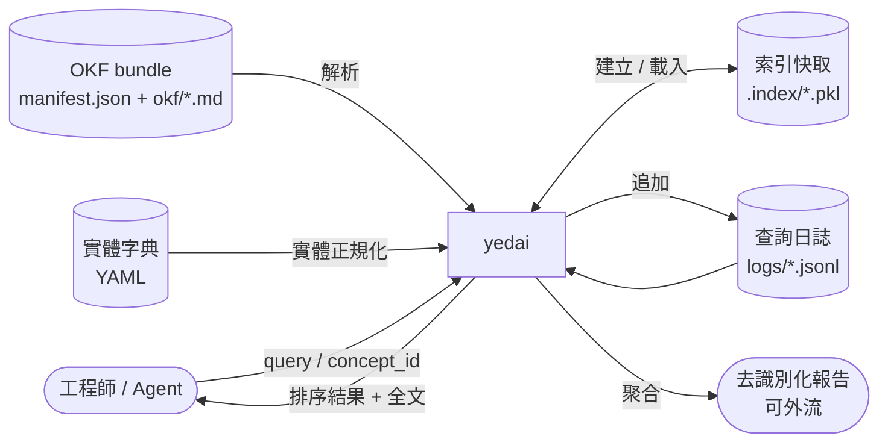
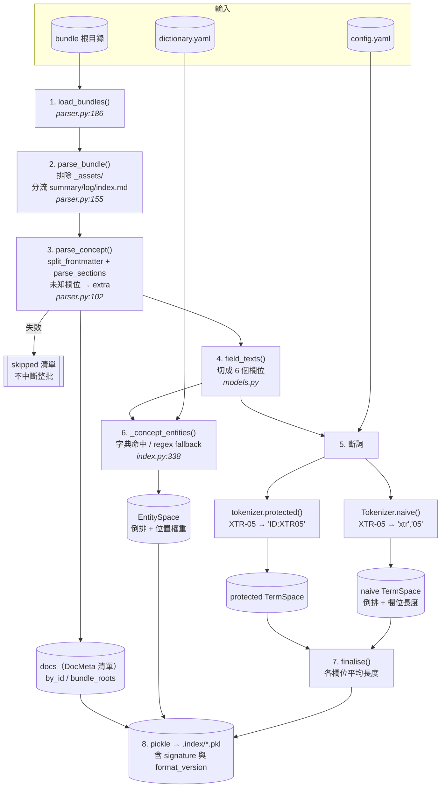
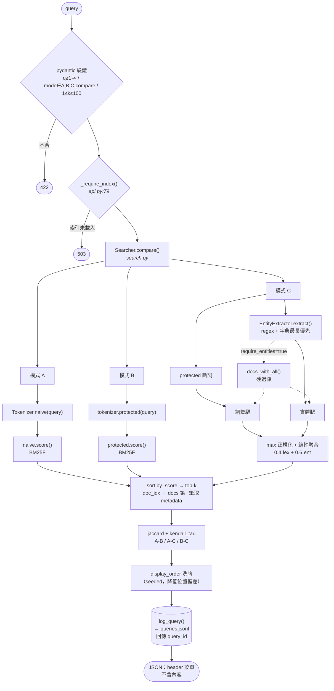
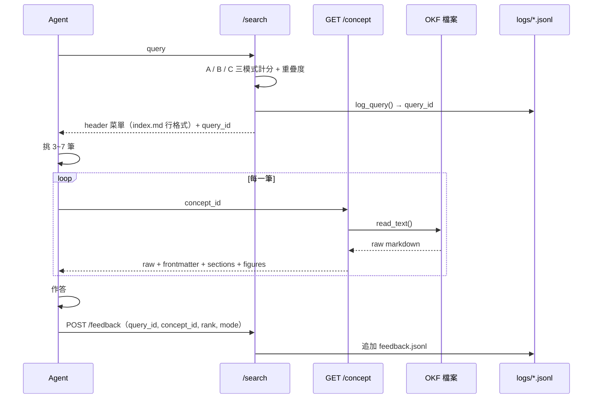
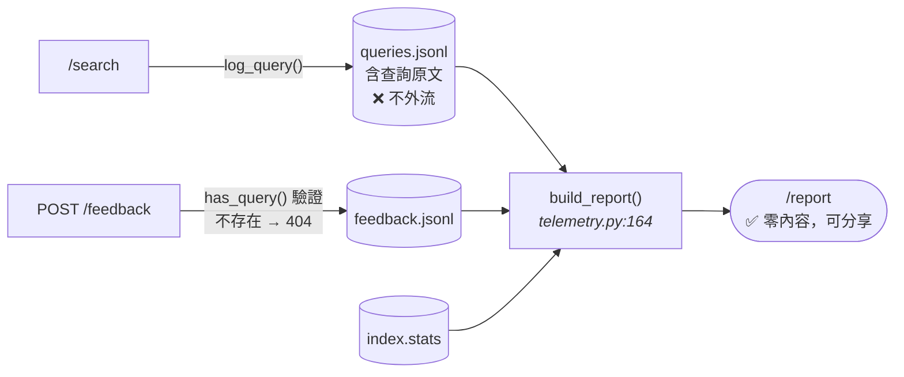

# Data Flow

資料從 OKF bundle 進入系統，到查詢結果與全文回到呼叫端的完整路徑。

系統有**兩個時間上分離的階段**：離線建索引（`yedai index`）與線上查詢（HTTP / CLI）。
兩者唯一的介面是磁碟上的索引檔與原始 OKF 檔案。

---

## Level 0 — 情境圖



**信任邊界**：`OKF bundle`、`索引快取`、`查詢日誌` 全部含機密內容，只存在本機。
只有 `去識別化報告` 設計為可外流——它不含任何查詢原文或語料內容。

---

## Level 1 — 階段一：離線建索引

指令：`yedai index <bundles-dir> -c config.yaml`



### 每個 concept 被切成 6 個欄位

`Concept.field_texts()` → `title` / `description` / `tags` / `headings` / `figures` / `body`
（`FIELDS`，`config.py:16`）。BM25F 對每個欄位獨立做長度正規化後加權合併。

### 同一份語料建了三套索引

| 空間 | 內容 | 服務哪個模式 |
|---|---|---|
| `naive` TermSpace | 天真斷詞的倒排索引 | **A** |
| `protected` TermSpace | 識別碼保護斷詞的倒排索引 | **B**、**C** 的詞彙腿 |
| `EntitySpace` | 實體倒排索引 + 位置權重 | **C** 的實體腿 |

三者建在**完全相同的 concept 集合**上，所以 A/B/C 的差異只來自索引方式，不來自語料。

### 索引裡有什麼、沒有什麼

**有**：`DocMeta`（id / bundle / type / title / description / path / tags / timestamp）、
詞頻與欄位長度統計、實體權重、`by_id`、`bundle_roots`、`CorpusStats`。

**沒有**：**任何 concept 的 body 內容**。全文於請求時從磁碟讀（見下方階段三）。
這由測試強制守住：`tests/test_fulltext.py::test_index_does_not_contain_body`
會把索引 pickle 成位元組並斷言 body 標記不在其中。

---

## Level 1 — 階段二：線上查詢

`GET /search?q=…&mode=compare&k=10`（`api.py:137`）



### 計分

**BM25F**（`TermSpace.score`，`index.py:46` 起）：

```
idf(t)   = log(1 + (N − df + 0.5) / (df + 0.5))

tf̃(t,d)  = Σ_f  w_f · tf_f / (1 − b + b · len_f / avglen_f)      各欄位獨立長度正規化

score   += qn(t) · idf(t) · tf̃ / (k1 + tf̃)
```

預設 `w` = title 3.0 / description 2.0 / tags 2.0 / headings 1.5 / figures 1.5 / body 1.0；
`k1` = 1.2、`b` = 0.75。全部可由設定檔覆寫，且會被記進報告的 `experiment_params`。

**實體腿**（`EntitySpace.score`，`index.py:117` 起）：

```
num(d) = Σ_{e ∈ q∩d}  idf(e) · boost(e,d)        boost = 該實體在 d 中出現過的最高欄位權重
den    = Σ_{e ∈ q}    idf(e) · max_field_weight  分母含「語料裡不存在的查詢實體」
score  = num / den  ∈ [0,1]
```

分母刻意包含語料中不存在的查詢實體——語料涵蓋不了的查詢本來就不該拿滿分。

**融合**（`Searcher._hybrid`）：

```
lex_n = lex / max(lex over candidates)     詞彙腿在結果集內做 max 正規化
final = 0.4 · lex_n + 0.6 · ent            實體腿本身已是 [0,1] 的涵蓋率，不再正規化
```

不用 RRF：RRF 只吃排名、會抹掉分數資訊，那樣就無法回答「哪一條腿貢獻了多少」——
而那正是這套工具存在的目的。

### 回應內容

每筆只有 `concept_id` / `bundle_id` / `type` / `title` / `description` / `path` /
`score` / `lexical_score` / `entity_score` / `index_line`。

**刻意不回傳內容片段。** 回一份菜單、讓 agent 自己決定讀哪幾份全文，才保得住
「agent 讀完整文件並自行判斷」這個讓小規模 agentic file search 效果好的性質。

---

## Level 1 — 階段三：取回全文

`GET /concept/{concept_id}`（`api.py:171` → `fulltext.load_concept`，`fulltext.py:55`）


**404 與 410 刻意分開**：前者是 id 打錯，後者是語料在建索引後變動了。
兩者需要的處置完全不同，混為一談會讓使用者無從判斷該不該重建索引。

**路徑防線**：`concept_id` 只用於查 `by_id`，實際路徑來自索引而非使用者輸入；
仍額外驗證解析結果落在 bundle 根目錄之下，以防索引被竄改或人工編輯出錯。

### ⚠️ 內容編輯與檢索排名的不同步

全文從磁碟讀，但**詞頻統計仍留在索引裡**。因此改一個 `.md` 之後：

| | 是否立即反映 |
|---|---|
| `/concept/{id}` 的內容 | ✅ 立即 |
| `/search` 的排名 | ❌ 要重建索引 |

詳見 [indexing.md](./indexing.md#4-何時必須重建索引)。

---

## 完整迴路



---

## 遙測：兩條獨立路徑



`build_report()` 只輸出數量、比例、分佈與設定參數。
`tests/test_telemetry.py::test_report_leaks_no_corpus_content` 斷言報告序列化後
不含任何查詢原文、concept 標題、描述或實體名稱——由測試強制，不靠慣例。

報告中最關鍵的欄位是 `mode_overlap`：A-B 的 jaccard 接近 1 代表斷詞層沒有作用、
B-C 接近 1 代表字典不值得維護。判讀方式見 [README](../README.md#怎麼讀報告)。

---

## 資料存放位置

| 資料 | 位置 | 機密 | 版控 |
|---|---|---|---|
| OKF bundle 原檔 | 使用者指定路徑 | ✅ | ❌ gitignore |
| 索引快取 | `.index/*.pkl` | ✅（含 title/description） | ❌ gitignore |
| 完整查詢日誌 | `logs/queries.jsonl` | ✅（含查詢原文） | ❌ gitignore |
| 點選回饋 | `logs/feedback.jsonl` | ⚠️（含 concept_id） | ❌ gitignore |
| 去識別化報告 | `yedai report -o` 指定路徑 | ❌ | 可分享 |
| 合成語料 | `.synthetic/` | ❌ | ❌ gitignore |

---

## 目前流程的缺口

已補：`/concept/{id}` 讓 agent 拿得到全文。

尚未實作（後續變更）：

| 缺口 | 影響 |
|---|---|
| 批次取全文 | agent 一次要讀 3~7 份，目前得逐筆 round trip |
| `neighbors`（沿 `related` 展開） | 無法重現 agent 目前用 `related` 跳轉的行為 |
| 限定範圍 `grep` | 範圍縮小後無法恢復原本有效的 agentic file search |
| MCP server | claude-agent-sdk 目前得自行包 HTTP 工具定義 |
| 三欄並排 Web UI | Swagger 無法收集點選資料，`/feedback` 實際上沒人會用 |
